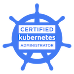
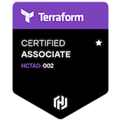
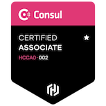
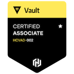

# Hi there 👋

## Certifications

<table>
<thead>
  <tr>
    <th>Certified Kubernetes Administrator</th>
    <th>Certified Kubernetes Application Developer</th>
    <th>Hashicorp Terraform Associate</th>
    <th>Hashicorp Consul Associate</th>
    <th>Hashicorp Vault Associate</th>
  </tr>
</thead>
<tbody>
  <tr>
    <td>
        
    </td>
    <td>
         
    </td>
    <td>
        
    </td>
    <td>
        
    </td>
    <td> 
        
   </td>
  </tr>
</tbody>
</table>

<!--
**aazon/aazon** is a ✨ _special_ ✨ repository because its `README.md` (this file) appears on your GitHub profile.

Here are some ideas to get you started:

- 🔭 I’m currently working on ...
- 🌱 I’m currently learning ...
- 👯 I’m looking to collaborate on ...
- 🤔 I’m looking for help with ...
- 💬 Ask me about ...
- 📫 How to reach me: ...
- 😄 Pronouns: ...
- ⚡ Fun fact: ...
-->
